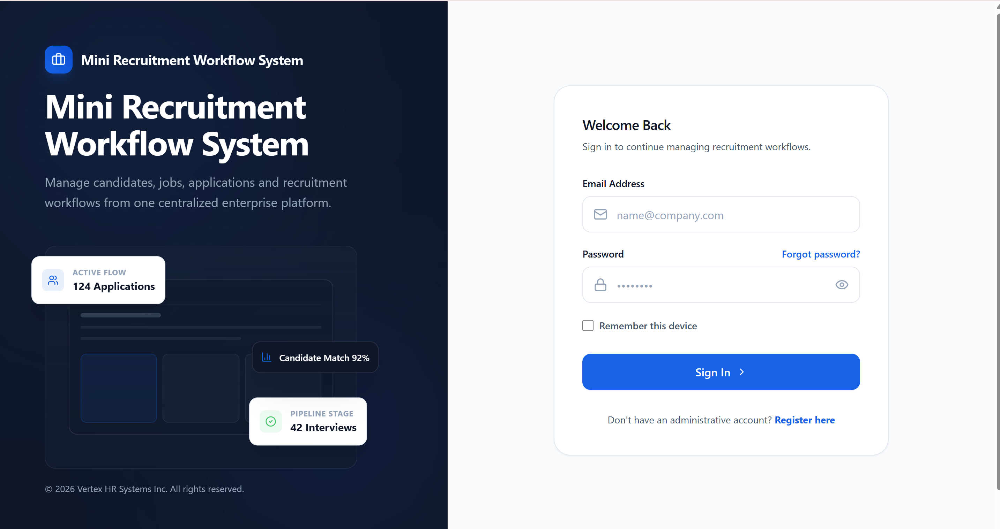
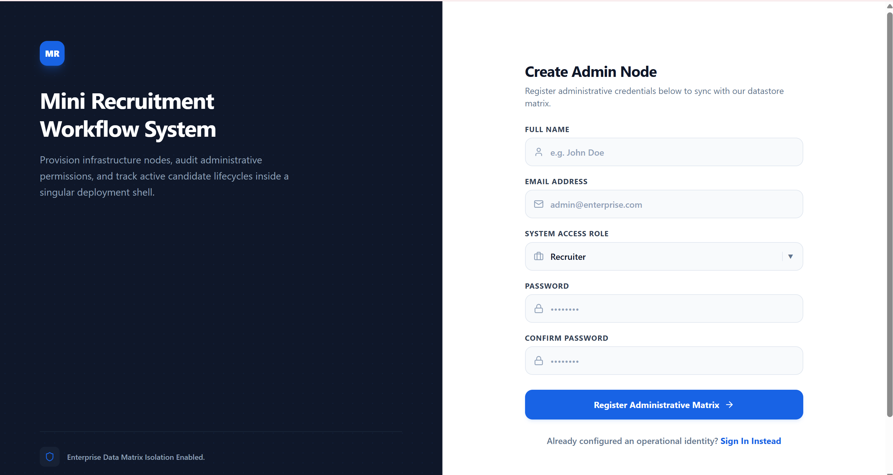
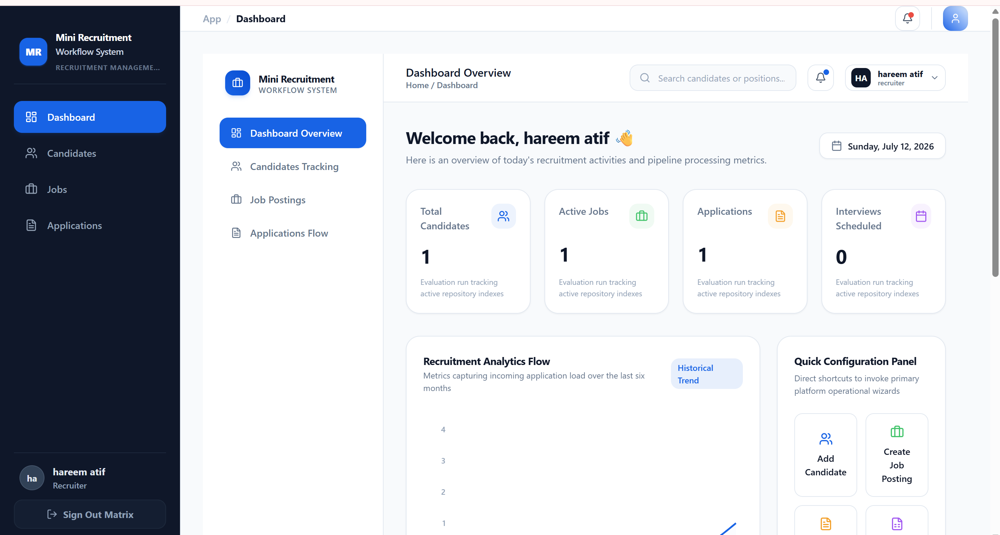
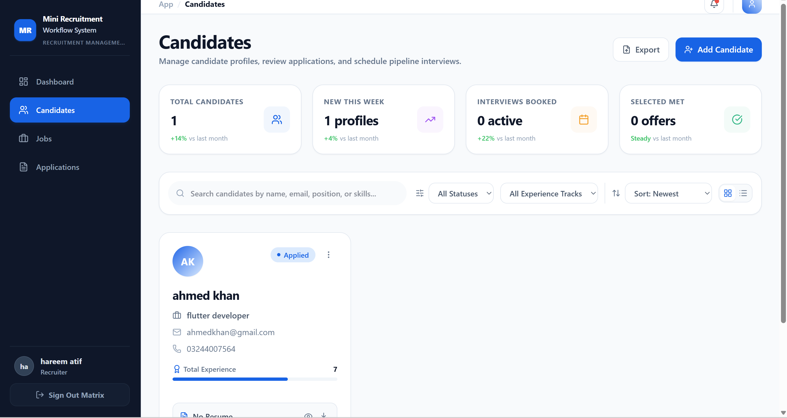
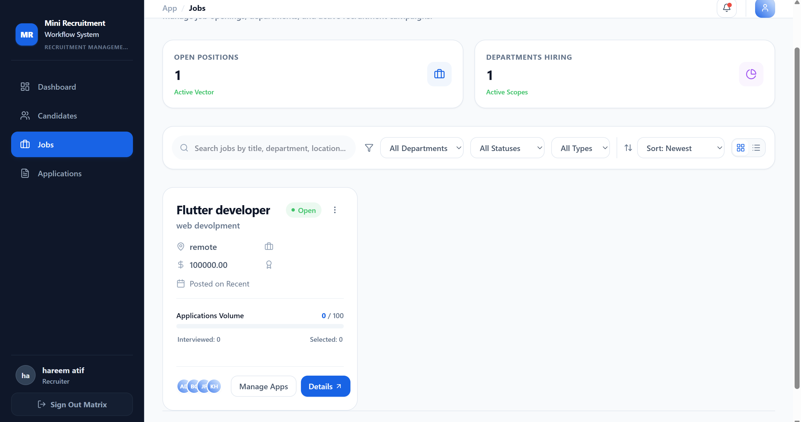
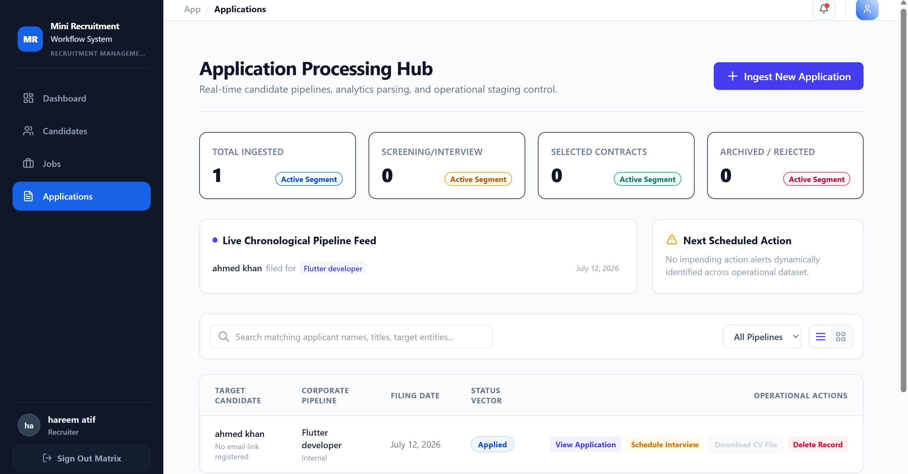

# 🚀 Mini Recruitment Workflow System

<div align="center">


A modern **Full Stack Recruitment Management System** that simplifies hiring by managing **Candidates, Jobs, Applications, Authentication, and Recruitment Workflow** through a clean and responsive dashboard.

</div>

---

# 📖 Overview

The **Mini Recruitment Workflow System** is a complete recruitment platform designed for recruiters and HR teams.

The system allows recruiters to:

- Manage candidate profiles
- Create and manage job postings
- Track applications
- Review candidate information
- Monitor recruitment statistics
- Search and filter records
- Perform complete CRUD operations
- Manage the hiring workflow efficiently

This project was developed using modern full-stack technologies with a responsive user interface and REST API architecture.

---

# ✨ Features

## 🔐 Authentication

- User Registration
- Secure Login
- Session Authentication
- Protected Routes

---

## 📊 Dashboard

- Recruitment Overview
- Total Candidates
- Active Jobs
- Applications Count
- Interview Statistics
- Responsive Analytics Cards

---

## 👥 Candidate Management

- Add Candidate
- Edit Candidate
- Delete Candidate
- Candidate Profile
- Resume Support
- Experience Tracking
- Candidate Search
- Status Filters

---

## 💼 Job Management

- Create Job
- Edit Job
- Delete Job
- Search Jobs
- Department Filters
- Hiring Status

---

## 📂 Application Management

- View Applications
- Candidate Tracking
- Interview Scheduling
- Status Management
- Application Details

---

## 🔍 Search & Filtering

- Search Candidates
- Search Jobs
- Search Applications
- Sort Results
- Filter by Status
- Filter by Experience

---

## 📱 Responsive Design

- Desktop Friendly
- Tablet Friendly
- Mobile Responsive
- Smooth Animations
- Modern UI

---

# 🖼 Application Screenshots

---

## Login



---

## Register



---

## Dashboard



---

## Candidates



---

## Jobs



---

## Applications



---

# 🛠 Tech Stack

## Frontend

- React.js
- Vite
- Tailwind CSS
- Axios
- React Router
- Framer Motion
- Lucide React

---

## Backend

- Node.js
- Express.js

---

## Database

- PostgreSQL

---

# 📂 Project Structure

```
Mini-Recruitment-System
│
├── backend
│   ├── controllers
│   ├── routes
│   ├── middleware
│   ├── config
│   ├── database
│   ├── models
│   └── server.js
│
├── frontend
│   ├── src
│   │
│   ├── pages
│   ├── components
│   ├── assets
│   ├── api
│   ├── hooks
│   └── App.jsx
│
├── images
│
└── README.md
```

---

# ⚙ Installation

## Clone Repository

```bash
git clone https://github.com/GearAndCode/Mini-Recruitment-System.git
```

---

## Backend

```bash
cd backend

npm install

npm start
```

---

## Frontend

```bash
cd frontend

npm install

npm run dev
```

---

# 🗄 Database

This project uses **PostgreSQL**.

Configure your database credentials inside the `.env` file.

Example:

```env
PORT=5000

DB_HOST=localhost
DB_PORT=5432
DB_USER=postgres
DB_PASSWORD=yourpassword
DB_NAME=recruitment_db
```

---

# 🌐 REST API

## Candidates

| Method | Endpoint |
|---------|----------|
| GET | /api/candidates |
| POST | /api/candidates |
| PUT | /api/candidates/:id |
| DELETE | /api/candidates/:id |

---

## Jobs

| Method | Endpoint |
|---------|----------|
| GET | /api/jobs |
| POST | /api/jobs |
| PUT | /api/jobs/:id |
| DELETE | /api/jobs/:id |

---

## Applications

| Method | Endpoint |
|---------|----------|
| GET | /api/applications |
| POST | /api/applications |
| PUT | /api/applications/:id |
| DELETE | /api/applications/:id |

---

# 📌 Main Modules

- Authentication
- Dashboard
- Candidate Management
- Job Management
- Application Management
- Search System
- Filtering
- CRUD Operations
- PostgreSQL Database
- REST API

---

# 🎯 Future Improvements

- Resume Upload Storage
- Email Notifications
- Interview Calendar
- Recruiter Roles
- Analytics Dashboard
- CSV Export
- Dark Mode
- Docker Deployment
- JWT Authentication
- Cloud Storage Integration

---

# 📚 Learning Outcomes

This project demonstrates practical experience with:

- Full Stack Web Development
- React Development
- REST API Design
- PostgreSQL
- Express.js
- Node.js
- CRUD Operations
- Responsive UI Design
- State Management
- Component Architecture
- Database Integration
- Authentication
- Routing
- API Consumption

---

# 👩‍💻 Developer

## Hareem Atif

Computer Science Student

Flutter Developer • Full Stack Developer

GitHub

https://github.com/GearAndCode

---

# ⭐ Show Your Support

If you found this project useful, please consider giving it a ⭐ on GitHub.

It helps others discover the project and supports future improvements.

---

# 📄 License

This project is licensed under the MIT License.

Developed for educational, portfolio, and demonstration purposes.

© 2026 Hareem Atif

